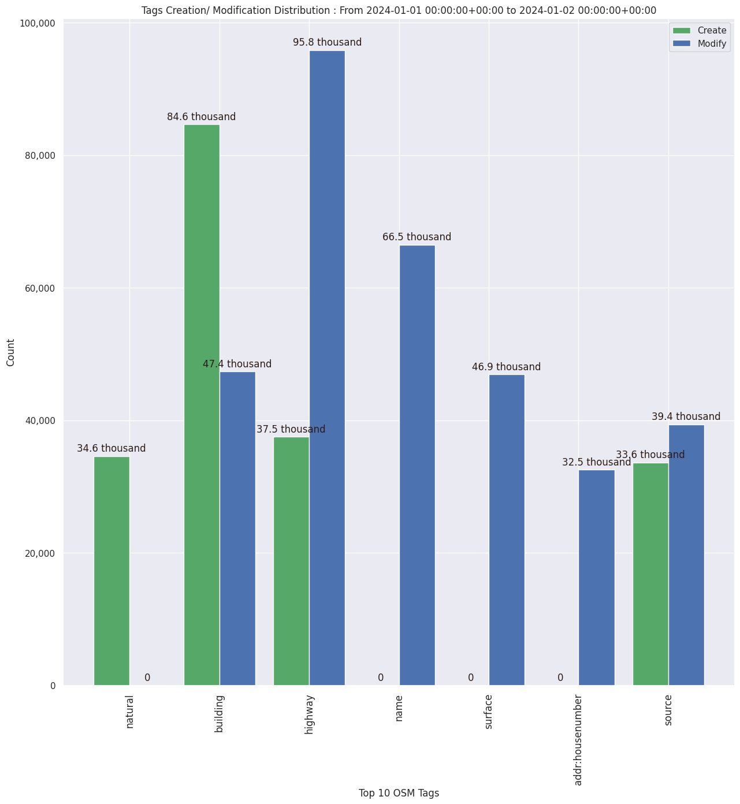

### Last Update : Stats from 2023-12-27 00:00:00+00:00 to 2023-12-28 00:00:00+00:00 (UTC Timezone)

#### 5.6 thousand Users made 43.8 thousand changesets with 3.8 million map changes.
#### 2.9 million OSM Elements were Created, 684.7 thousand Modified & 258.7 thousand Deleted.
Get Full Stats at [stats.csv](/stats/Global/Daily/stats.csv)
 & Get Summary Stats at [stats_summary.csv](/stats/Global/Daily/stats_summary.csv)

Top 5 Users are : 
- dmich9 : 634.9 thousand Map Changes
- jmarchon : 82.2 thousand Map Changes
- Manfutu : 69.7 thousand Map Changes
- btns : 62.0 thousand Map Changes
- nitemoon : 57.8 thousand Map Changes

Summary of Supplied Tags
- poi = Created: 82.6 thousand, Modified : 45.2 thousand
- building = Created: 118.6 thousand, Modified : 52.8 thousand
- highway = Created: 48.1 thousand, Modified : 122.4 thousand
- waterway = Created: 21.2 thousand, Modified : 4.7 thousand
- amenity = Created: 8.3 thousand, Modified : 11.3 thousand

Top 5 Created tags are :
- building: 118.6 thousand
- source: 68.0 thousand
- highway: 48.1 thousand
- addr:housenumber: 45.9 thousand
- addr:street: 43.7 thousand

Top 5 Modified tags are :
- highway: 122.4 thousand
- name: 82.6 thousand
- surface: 61.0 thousand
- building: 52.8 thousand
- source: 42.4 thousand

Top 5 trending hashtags are:
- #adt : 146 users
- #maproulette : 63 users
- #missingmaps : 46 users
- #hotosm-project-13532 : 27 users

Top 5 trending editors are:
- iD 2.27.3 : 2731 users
- StreetComplete 55.1 : 723 users
- JOSM/1.5 (18822 en) : 228 users
- JOSM/1.5 (18907 en) : 220 users
- iD 2.21.1 : 139 users

Top 5 trending Countries where user contributed are:
- Germany : 816 users
- United States of America : 604 users
- France : 444 users
- Poland : 237 users
- U.K. of Great Britain and Northern Ireland : 230 users

 Charts : 
 
 
 
 
 
