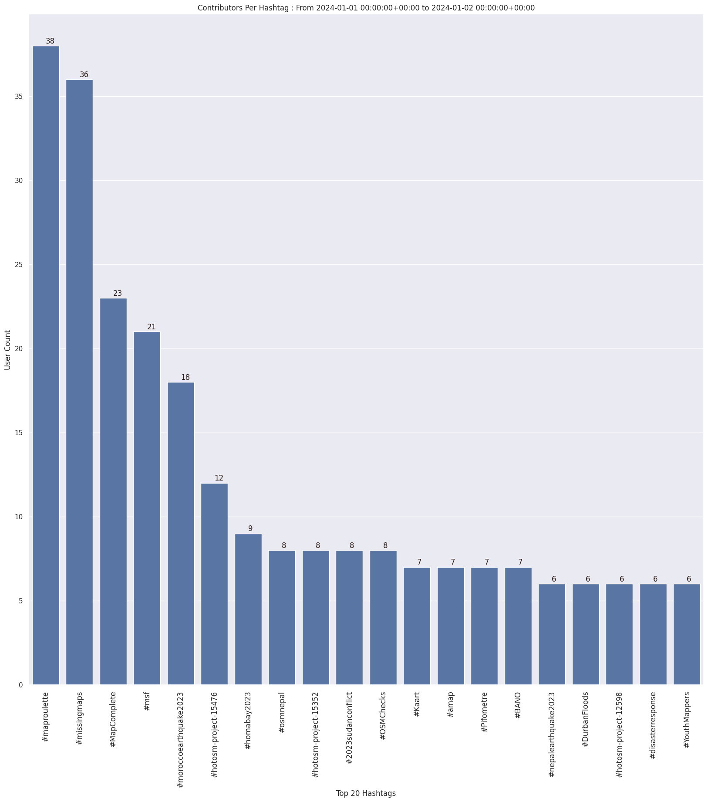

### Last Update : Stats from 2023-12-22 00:00:00+00:00 to 2023-12-23 00:00:00+00:00 (UTC Timezone)

#### 5.0 thousand Users made 34.6 thousand changesets with 4.7 million map changes.
#### 3.8 million OSM Elements were Created, 605.7 thousand Modified & 275.4 thousand Deleted.
Get Full Stats at [stats.csv](/stats/Global/Daily/stats.csv)
 & Get Summary Stats at [stats_summary.csv](/stats/Global/Daily/stats_summary.csv)

Top 5 Users are : 
- dmich9 : 832.8 thousand Map Changes
- jmarchon : 658.9 thousand Map Changes
- SherbetS_Import : 436.7 thousand Map Changes
- UNGSC - Dimitrios : 53.3 thousand Map Changes
- jptolosa : 32.0 thousand Map Changes

Summary of Supplied Tags
- poi = Created: 57.4 thousand, Modified : 39.2 thousand
- building = Created: 97.2 thousand, Modified : 51.5 thousand
- highway = Created: 48.3 thousand, Modified : 95.6 thousand
- waterway = Created: 41.2 thousand, Modified : 4.7 thousand
- amenity = Created: 8.1 thousand, Modified : 8.8 thousand

Top 5 Created tags are :
- building: 97.2 thousand
- source: 78.9 thousand
- natural: 52.3 thousand
- highway: 48.3 thousand
- waterway: 41.2 thousand

Top 5 Modified tags are :
- highway: 95.6 thousand
- name: 66.6 thousand
- building: 51.5 thousand
- surface: 41.7 thousand
- addr:housenumber: 38.9 thousand

Top 5 trending hashtags are:
- #adt : 161 users
- #maproulette : 83 users
- #missingmaps : 44 users
- #msf : 30 users

Top 5 trending editors are:
- iD 2.27.3 : 2556 users
- StreetComplete 55.1 : 492 users
- JOSM/1.5 (18822 en) : 251 users
- JOSM/1.5 (18907 en) : 194 users
- iD 2.21.1 : 142 users

Top 5 trending Countries where user contributed are:
- Germany : 660 users
- United States of America : 600 users
- France : 364 users
- U.K. of Great Britain and Northern Ireland : 224 users
- Poland : 190 users

 Charts : 
 
 
 
 
 
