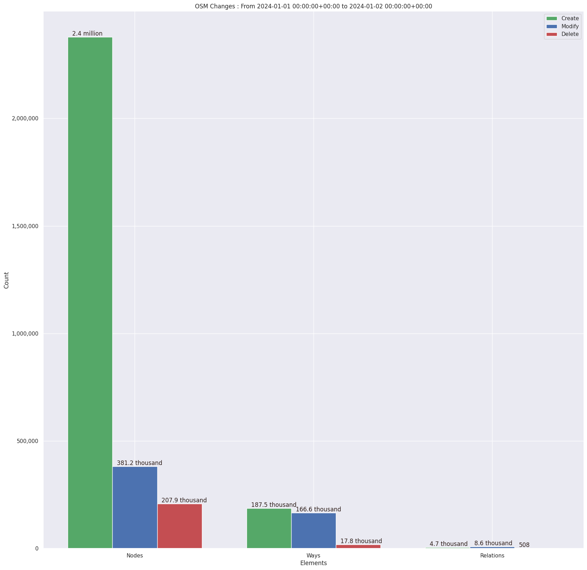
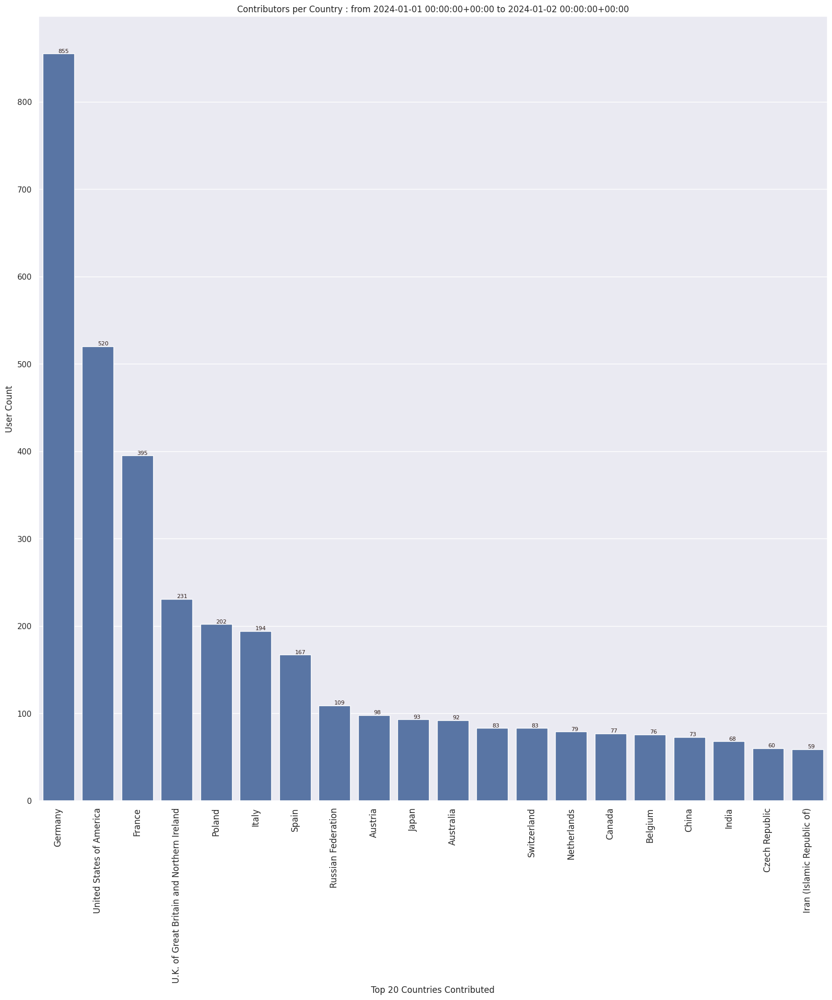

### Last Update : Stats from 2023-12-28 00:00:00+00:00 to 2023-12-29 00:00:00+00:00 (UTC Timezone)

#### 5.7 thousand Users made 43.8 thousand changesets with 3.7 million map changes.
#### 2.8 million OSM Elements were Created, 679.1 thousand Modified & 241.1 thousand Deleted.
Get Full Stats at [stats.csv](/stats/Global/Daily/stats.csv)
 & Get Summary Stats at [stats_summary.csv](/stats/Global/Daily/stats_summary.csv)

Top 5 Users are : 
- SherbetS_Import : 318.5 thousand Map Changes
- dmich9 : 149.7 thousand Map Changes
- ryoro : 69.8 thousand Map Changes
- Heinz_V : 66.6 thousand Map Changes
- revent : 61.3 thousand Map Changes

Summary of Supplied Tags
- poi = Created: 78.0 thousand, Modified : 49.6 thousand
- building = Created: 130.4 thousand, Modified : 69.2 thousand
- highway = Created: 52.9 thousand, Modified : 127.9 thousand
- waterway = Created: 11.1 thousand, Modified : 4.5 thousand
- amenity = Created: 9.3 thousand, Modified : 10.4 thousand

Top 5 Created tags are :
- building: 130.4 thousand
- source: 53.8 thousand
- highway: 52.9 thousand
- addr:housenumber: 42.0 thousand
- addr:street: 38.7 thousand

Top 5 Modified tags are :
- highway: 127.9 thousand
- name: 91.6 thousand
- building: 69.2 thousand
- surface: 56.5 thousand
- addr:housenumber: 43.2 thousand

Top 5 trending hashtags are:
- #adt : 166 users
- #maproulette : 57 users
- #missingmaps : 45 users
- #MapComplete : 27 users

Top 5 trending editors are:
- iD 2.27.3 : 2764 users
- StreetComplete 55.1 : 767 users
- JOSM/1.5 (18822 en) : 260 users
- JOSM/1.5 (18907 en) : 216 users
- Vespucci 19.3.2.0 : 131 users

Top 5 trending Countries where user contributed are:
- Germany : 881 users
- United States of America : 590 users
- France : 449 users
- U.K. of Great Britain and Northern Ireland : 259 users
- Italy : 222 users

 Charts : 
 
 
 
 
 
