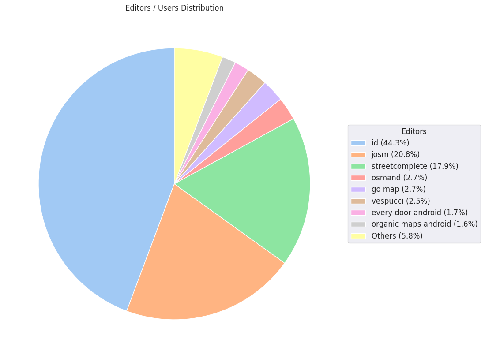

### Last Update : Stats from 2023-12-10 00:00:00+00:00 to 2023-12-11 00:00:00+00:00 (UTC Timezone)

#### 4.6 thousand Users made 29.4 thousand changesets with 3.3 million map changes.
#### 2.3 million OSM Elements were Created, 703.2 thousand Modified & 216.7 thousand Deleted.
Get Full Stats at [stats.csv](/stats/Global/Daily/stats.csv)
 & Get Summary Stats at [stats_summary.csv](/stats/Global/Daily/stats_summary.csv)

Top 5 Users are : 
- jmarchon : 245.1 thousand Map Changes
- dmich9 : 232.3 thousand Map Changes
- Thomas Jarvis : 49.2 thousand Map Changes
- UNGSC - Dimitrios : 45.2 thousand Map Changes
- turankaya74 : 40.8 thousand Map Changes

Summary of Supplied Tags
- poi = Created: 57.1 thousand, Modified : 92.8 thousand
- building = Created: 96.6 thousand, Modified : 61.0 thousand
- highway = Created: 38.0 thousand, Modified : 95.2 thousand
- waterway = Created: 15.2 thousand, Modified : 5.4 thousand
- amenity = Created: 8.1 thousand, Modified : 14.2 thousand

Top 5 Created tags are :
- building: 96.6 thousand
- source: 46.6 thousand
- highway: 38.0 thousand
- natural: 34.7 thousand
- addr:housenumber: 20.0 thousand

Top 5 Modified tags are :
- highway: 95.2 thousand
- name: 81.5 thousand
- addr:housenumber: 79.7 thousand
- addr:street: 78.8 thousand
- building: 61.0 thousand

Top 5 trending hashtags are:
- #missingmaps : 52 users
- #maproulette : 38 users
- #msf : 32 users
- #homabay2023 : 21 users

Top 5 trending editors are:
- iD 2.27.3 : 2321 users
- StreetComplete 55.1 : 557 users
- JOSM/1.5 (18907 en) : 156 users
- JOSM/1.5 (18822 en) : 134 users
- Vespucci 19.3.1.0 : 124 users

Top 5 trending Countries where user contributed are:
- Germany : 722 users
- United States of America : 470 users
- France : 368 users
- U.K. of Great Britain and Northern Ireland : 232 users
- Italy : 205 users

 Charts : 
 
 
 
 
 
