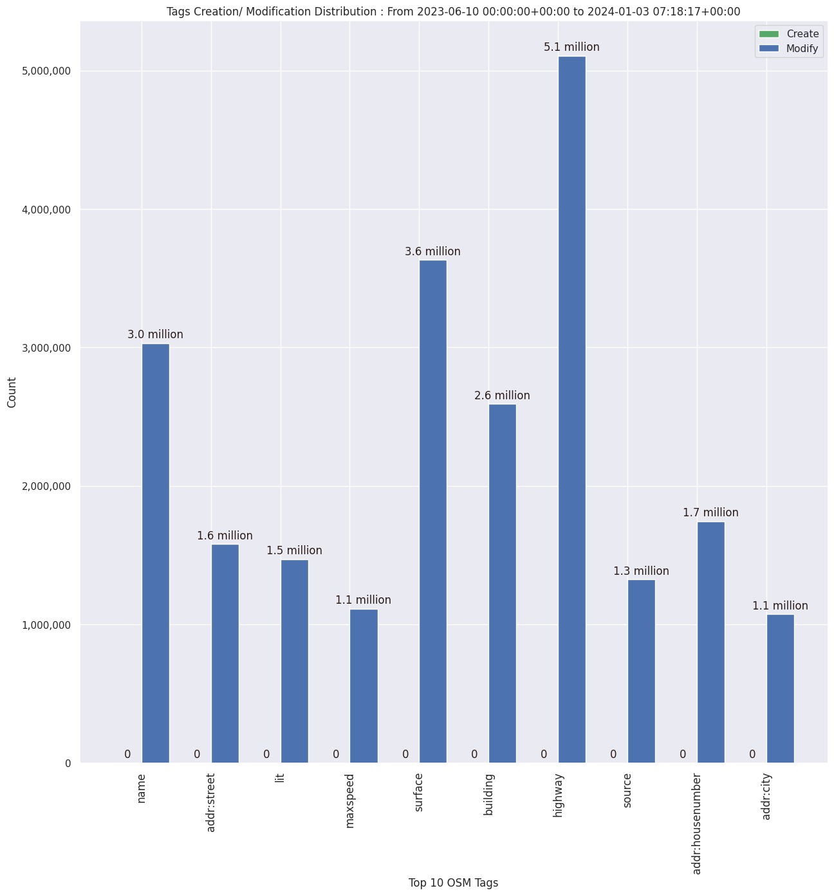

### Last Update : Stats from 2023-06-10 00:00:00+00:00 to 2023-12-31 07:15:16+00:00 (UTC Timezone)

#### 37.1 thousand Users made 2.2 million changesets with 14.6 million map changes.
#### 3.7 million OSM Elements were Created, 10.5 million Modified & 391.2 thousand Deleted.
Get Full Stats at [stats.csv](/stats/fieldmappers/Daily/stats.csv)
 & Get Summary Stats at [stats_summary.csv](/stats/fieldmappers/Daily/stats_summary.csv)

Top 5 Users are : 
- Đuro Jiří : 396.9 thousand Map Changes
- PizzaTreeIsland : 310.0 thousand Map Changes
- biketeur : 197.5 thousand Map Changes
- WN6 : 182.5 thousand Map Changes
- padvinder : 147.0 thousand Map Changes

Summary of Supplied Tags
- poi = Created: 766.8 thousand, Modified : 2.2 million
- amenity = Created: 247.9 thousand, Modified : 719.7 thousand

Top 5 Created tags are :
- highway: 272.6 thousand
- name: 270.4 thousand
- amenity: 247.9 thousand
- addr:housenumber: 122.4 thousand
- addr:street: 117.1 thousand

Top 5 Modified tags are :
- highway: 5.0 million
- surface: 3.6 million
- name: 3.0 million
- building: 2.6 million
- addr:housenumber: 1.7 million

Top 5 trending hashtags are:
- #MapHerWorld : 62 users
- #FLCHgrdUNMSM : 32 users
- #OsmUgcampaign : 16 users
- #everydoor : 16 users

Top 5 trending editors are:
- StreetComplete 53.3 : 10237 users
- StreetComplete 54.0 : 7463 users
- StreetComplete 55.0 : 6174 users
- StreetComplete 54.1 : 5876 users
- StreetComplete 53.2 : 5777 users

Top 5 trending Countries where user contributed are:
- Germany : 10009 users
- France : 4819 users
- United States of America : 3875 users
- Italy : 2194 users

 Charts : 
 
 
 
 
 
