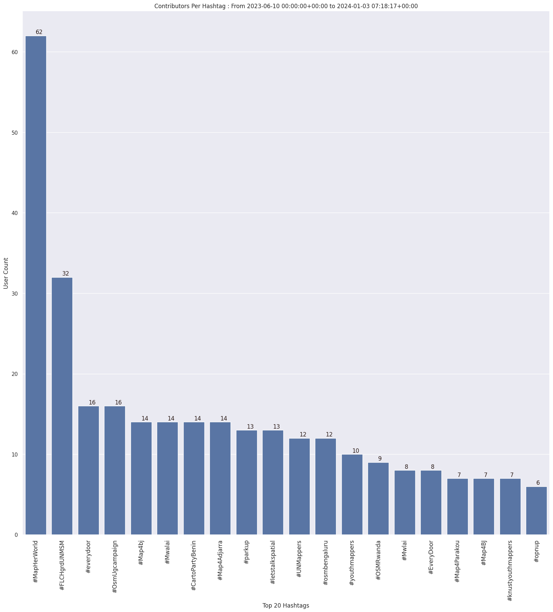

### Last Update : Stats from 2023-06-10 00:00:00+00:00 to 2023-12-21 07:16:35+00:00 (UTC Timezone)

#### 36.2 thousand Users made 2.1 million changesets with 13.8 million map changes.
#### 3.5 million OSM Elements were Created, 10.0 million Modified & 373.8 thousand Deleted.
Get Full Stats at [stats.csv](/stats/fieldmappers/Daily/stats.csv)
 & Get Summary Stats at [stats_summary.csv](/stats/fieldmappers/Daily/stats_summary.csv)

Top 5 Users are : 
- Đuro Jiří : 369.8 thousand Map Changes
- PizzaTreeIsland : 286.6 thousand Map Changes
- biketeur : 181.3 thousand Map Changes
- WN6 : 153.1 thousand Map Changes
- padvinder : 139.0 thousand Map Changes

Summary of Supplied Tags
- poi = Created: 731.7 thousand, Modified : 2.1 million
- amenity = Created: 236.7 thousand, Modified : 690.4 thousand

Top 5 Created tags are :
- highway: 260.0 thousand
- name: 255.9 thousand
- amenity: 236.7 thousand
- addr:housenumber: 117.6 thousand
- addr:street: 112.3 thousand

Top 5 Modified tags are :
- highway: 4.8 million
- surface: 3.4 million
- name: 2.8 million
- building: 2.4 million
- addr:housenumber: 1.6 million

Top 5 trending hashtags are:
- #MapHerWorld : 62 users
- #FLCHgrdUNMSM : 32 users
- #everydoor : 16 users
- #OsmUgcampaign : 16 users

Top 5 trending editors are:
- StreetComplete 53.3 : 10230 users
- StreetComplete 54.0 : 7449 users
- StreetComplete 55.0 : 6120 users
- StreetComplete 54.1 : 5855 users
- StreetComplete 53.2 : 5777 users

Top 5 trending Countries where user contributed are:
- Germany : 9786 users
- France : 4675 users
- United States of America : 3751 users
- Italy : 2151 users

 Charts : 
 
 
 
 
 
