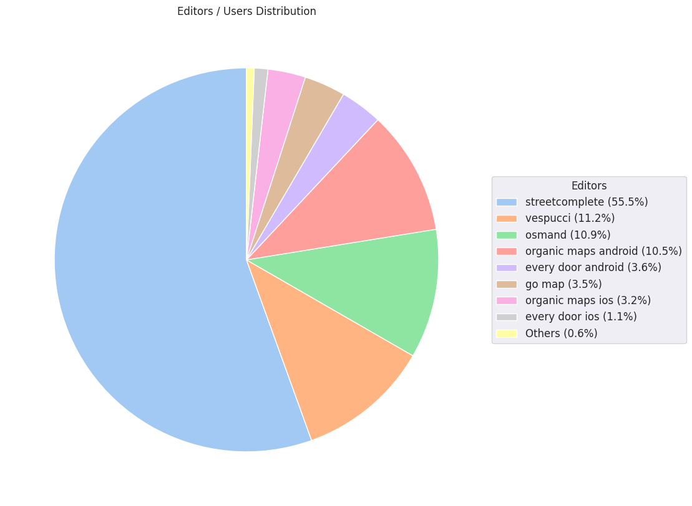

### Last Update : Stats from 2023-06-10 00:00:00+00:00 to 2023-12-10 07:16:03+00:00 (UTC Timezone)

#### 35.5 thousand Users made 2.0 million changesets with 13.2 million map changes.
#### 3.3 million OSM Elements were Created, 9.6 million Modified & 359.1 thousand Deleted.
Get Full Stats at [stats.csv](/stats/fieldmappers/Daily/stats.csv)
 & Get Summary Stats at [stats_summary.csv](/stats/fieldmappers/Daily/stats_summary.csv)

Top 5 Users are : 
- Đuro Jiří : 353.3 thousand Map Changes
- PizzaTreeIsland : 256.3 thousand Map Changes
- biketeur : 168.7 thousand Map Changes
- WN6 : 144.8 thousand Map Changes
- padvinder : 127.0 thousand Map Changes

Summary of Supplied Tags
- poi = Created: 700.9 thousand, Modified : 2.0 million
- amenity = Created: 227.6 thousand, Modified : 665.1 thousand

Top 5 Created tags are :
- highway: 248.4 thousand
- name: 243.7 thousand
- amenity: 227.6 thousand
- addr:housenumber: 111.1 thousand
- addr:street: 106.0 thousand

Top 5 Modified tags are :
- highway: 4.6 million
- surface: 3.3 million
- name: 2.7 million
- building: 2.3 million
- addr:housenumber: 1.5 million

Top 5 trending hashtags are:
- #MapHerWorld : 62 users
- #FLCHgrdUNMSM : 32 users
- #everydoor : 16 users
- #OsmUgcampaign : 16 users

Top 5 trending editors are:
- StreetComplete 53.3 : 10225 users
- StreetComplete 54.0 : 7441 users
- StreetComplete 55.0 : 6065 users
- StreetComplete 54.1 : 5844 users
- StreetComplete 53.2 : 5775 users

Top 5 trending Countries where user contributed are:
- Germany : 9607 users
- France : 4599 users
- United States of America : 3657 users
- Italy : 2109 users

 Charts : 
 
 
 
 
 
