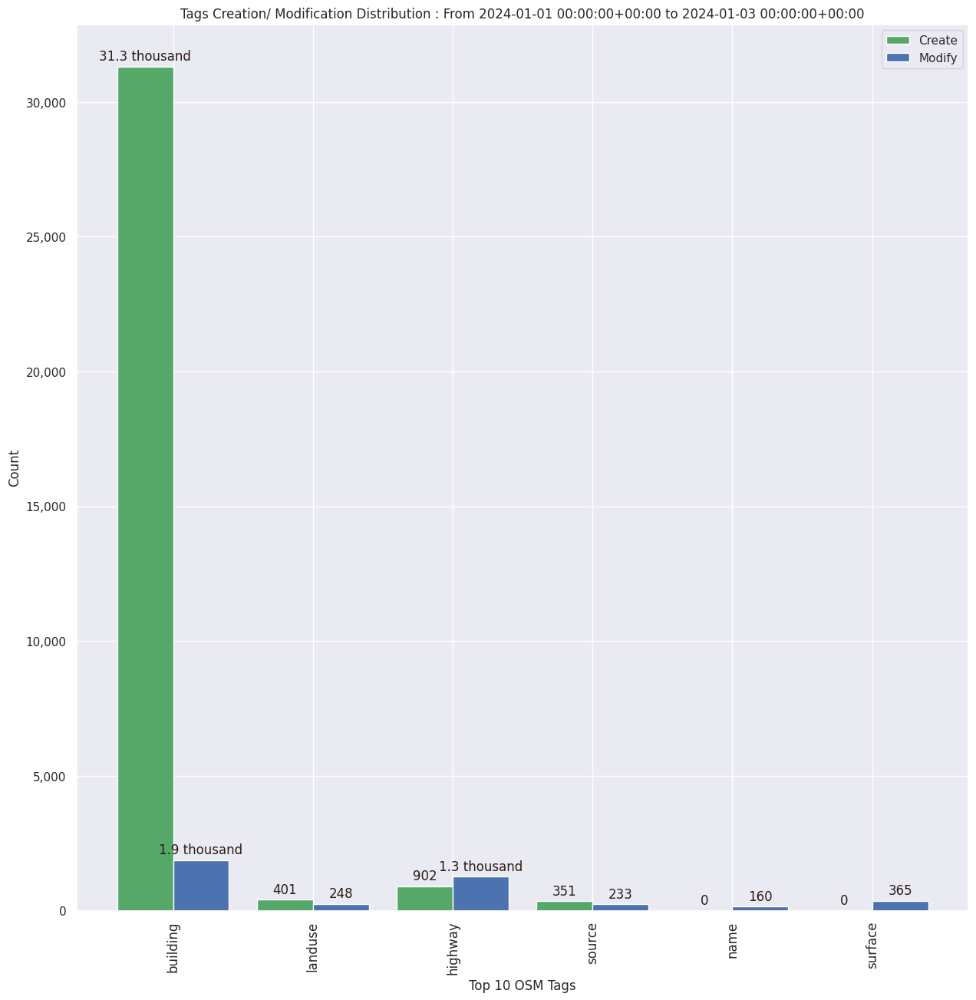

### Last Update : Stats from 2024-01-01 00:00:00+00:00 to 2024-01-03 00:00:00+00:00 (UTC Timezone)

#### 218 Users made 2.1 thousand changesets with 345.9 thousand map changes.
#### 218.1 thousand OSM Elements were Created, 85.1 thousand Modified & 42.7 thousand Deleted.
Get Full Stats at [stats.csv](/stats/hotosm/Daily/stats.csv)
 & Get Summary Stats at [stats_summary.csv](/stats/hotosm/Daily/stats_summary.csv)

Top 5 Users are : 
- Norbert Dichter : 18.4 thousand Map Changes
- koos krijnders : 17.3 thousand Map Changes
- Michel Bouillot : 14.3 thousand Map Changes
- TeBaMa : 12.1 thousand Map Changes
- mepng : 11.8 thousand Map Changes

Summary of Supplied Tags
- poi = Created: 21, Modified : 61
- building = Created: 31.3 thousand, Modified : 1.9 thousand
- highway = Created: 902, Modified : 1.3 thousand
- waterway = Created: 105, Modified : 74
- amenity = Created: 4, Modified : 13

Top 5 Created tags are :
- building: 31.3 thousand
- highway: 902
- landuse: 401
- source: 351
- barrier: 142

Top 5 Modified tags are :
- building: 1.9 thousand
- highway: 1.3 thousand
- surface: 365
- landuse: 248
- source: 233

Top 5 trending hashtags are:
- #missingmaps : 78 users
- #msf : 45 users
- #moroccoearthquake2023 : 33 users
- #hotosm-project-15476 : 25 users
- #2023sudanconflict : 19 users

Top 5 trending editors are:
- iD 2.21.1 : 127 users
- JOSM/1.5 (18822 en) : 20 users
- JOSM/1.5 (18907 en) : 19 users
- JOSM/1.5 (18907 en_GB) : 9 users
- JOSM/1.5 (18907 nl) : 7 users

Top 5 trending Countries where user contributed are:
- Morocco : 33 users
- Sudan : 33 users
- Kenya : 29 users
- Nepal : 20 users
- India : 19 users

 Charts : 
 
 
 
 
 
